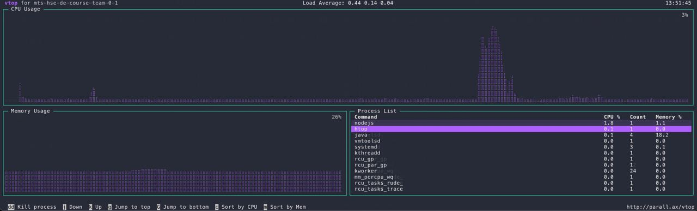
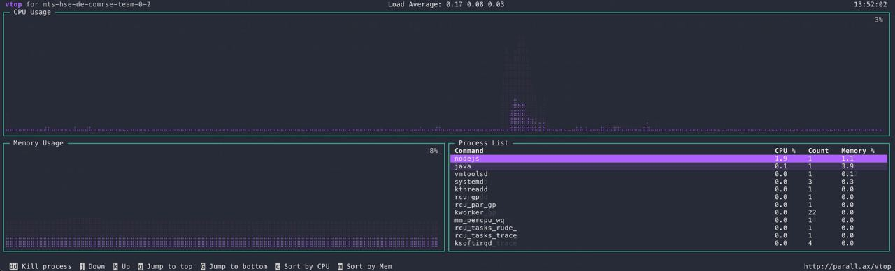
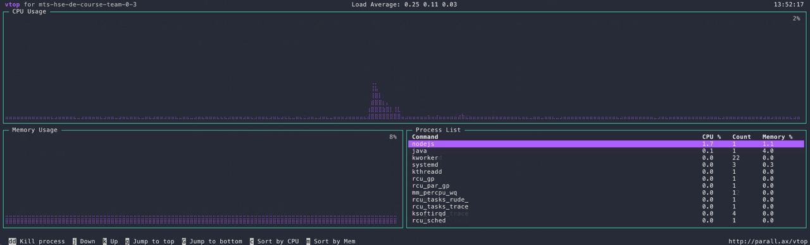
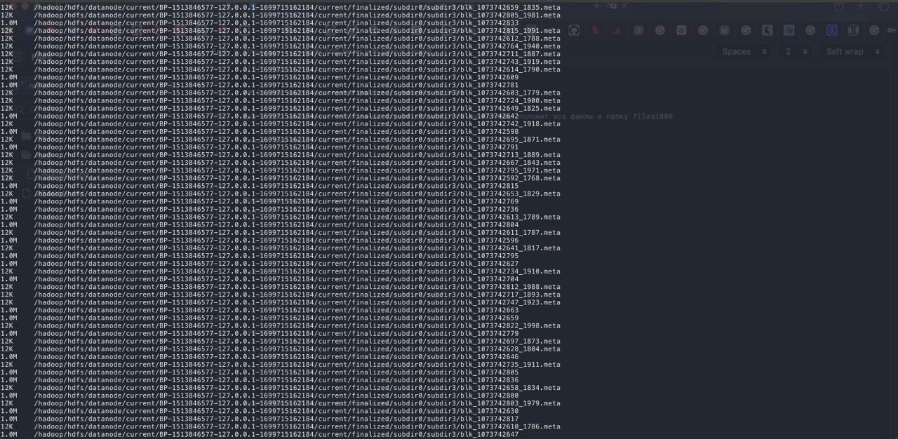
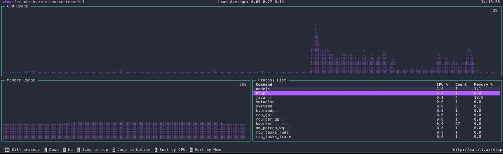
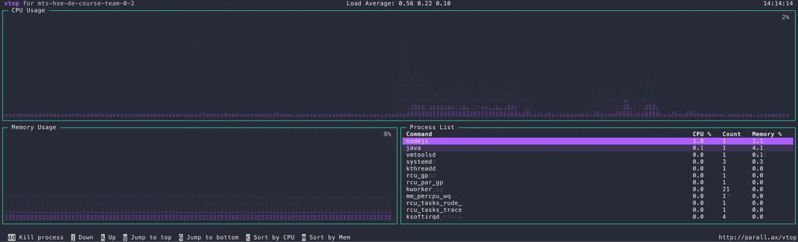
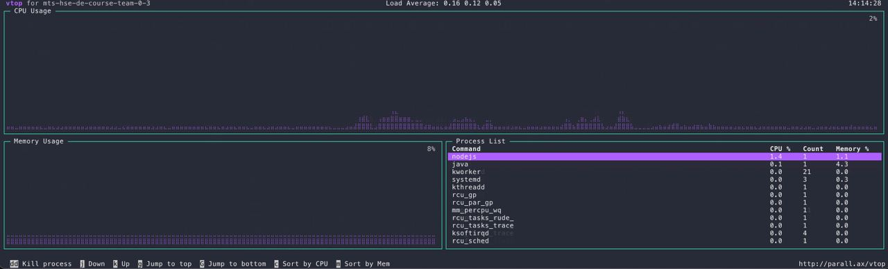

# ДЗ2

## Разместим на HDFS файл ~1Gb
```
dd if=/dev/zero of=one_file bs=1M count=1000
```
Получили файл размером ~1Gb

Посмотрим сколько памяти занято на нодах.
Для этого выполним на них команду:
```
df -h .
```
hadoop1:
```
Filesystem      Size  Used Avail Use% Mounted on
/dev/sda2       295G  9.8G  273G   4% /
```
hadoop2:
```
Filesystem      Size  Used Avail Use% Mounted on
/dev/sda2       295G  8.5G  274G   4% /
```
hadoop3:
```
Filesystem      Size  Used Avail Use% Mounted on
/dev/sda2       295G  8.5G  274G   4% /
```

Файл образа ФС и журнал изменений:
```
du -ah /hadoop/hdfs

4.0K	/hadoop/hdfs/namenode/in_use.lock
4.0K	/hadoop/hdfs/namenode/current/edits_0000000000000000070-0000000000000000071
4.0K	/hadoop/hdfs/namenode/current/edits_0000000000000000150-0000000000000000151
4.0K	/hadoop/hdfs/namenode/current/edits_0000000000000000098-0000000000000000099
4.0K	/hadoop/hdfs/namenode/current/edits_0000000000000000058-0000000000000000059
4.0K	/hadoop/hdfs/namenode/current/edits_0000000000000000012-0000000000000000013
4.0K	/hadoop/hdfs/namenode/current/edits_0000000000000000176-0000000000000000177
4.0K	/hadoop/hdfs/namenode/current/edits_0000000000000000192-0000000000000000193
4.0K	/hadoop/hdfs/namenode/current/fsimage_0000000000000000204.md5
4.0K	/hadoop/hdfs/namenode/current/edits_0000000000000000188-0000000000000000189
4.0K	/hadoop/hdfs/namenode/current/edits_0000000000000000022-0000000000000000023
4.0K	/hadoop/hdfs/namenode/current/edits_0000000000000000186-0000000000000000187
4.0K	/hadoop/hdfs/namenode/current/edits_0000000000000000194-0000000000000000202
4.0K	/hadoop/hdfs/namenode/current/edits_0000000000000000062-0000000000000000063
4.0K	/hadoop/hdfs/namenode/current/edits_0000000000000000203-0000000000000000204
4.0K	/hadoop/hdfs/namenode/current/edits_0000000000000000126-0000000000000000127
4.0K	/hadoop/hdfs/namenode/current/edits_0000000000000000180-0000000000000000181
4.0K	/hadoop/hdfs/namenode/current/edits_0000000000000000154-0000000000000000155
4.0K	/hadoop/hdfs/namenode/current/edits_0000000000000000074-0000000000000000075
4.0K	/hadoop/hdfs/namenode/current/edits_0000000000000000032-0000000000000000033
4.0K	/hadoop/hdfs/namenode/current/edits_0000000000000000178-0000000000000000179
4.0K	/hadoop/hdfs/namenode/current/edits_0000000000000000042-0000000000000000043
4.0K	/hadoop/hdfs/namenode/current/edits_0000000000000000134-0000000000000000135
4.0K	/hadoop/hdfs/namenode/current/edits_0000000000000000104-0000000000000000105
4.0K	/hadoop/hdfs/namenode/current/seen_txid
4.0K	/hadoop/hdfs/namenode/current/edits_0000000000000000160-0000000000000000161
4.0K	/hadoop/hdfs/namenode/current/edits_0000000000000000026-0000000000000000027
4.0K	/hadoop/hdfs/namenode/current/edits_0000000000000000130-0000000000000000131
4.0K	/hadoop/hdfs/namenode/current/VERSION
4.0K	/hadoop/hdfs/namenode/current/edits_0000000000000000050-0000000000000000051
4.0K	/hadoop/hdfs/namenode/current/fsimage_0000000000000000204
4.0K	/hadoop/hdfs/namenode/current/edits_0000000000000000082-0000000000000000083
4.0K	/hadoop/hdfs/namenode/current/edits_0000000000000000016-0000000000000000017
4.0K	/hadoop/hdfs/namenode/current/edits_0000000000000000182-0000000000000000183
4.0K	/hadoop/hdfs/namenode/current/edits_0000000000000000144-0000000000000000145
4.0K	/hadoop/hdfs/namenode/current/edits_0000000000000000064-0000000000000000065
4.0K	/hadoop/hdfs/namenode/current/edits_0000000000000000090-0000000000000000091
4.0K	/hadoop/hdfs/namenode/current/edits_0000000000000000162-0000000000000000163
4.0K	/hadoop/hdfs/namenode/current/edits_0000000000000000100-0000000000000000101
4.0K	/hadoop/hdfs/namenode/current/edits_0000000000000000080-0000000000000000081
4.0K	/hadoop/hdfs/namenode/current/edits_0000000000000000054-0000000000000000055
4.0K	/hadoop/hdfs/namenode/current/edits_0000000000000000158-0000000000000000159
4.0K	/hadoop/hdfs/namenode/current/edits_0000000000000000102-0000000000000000103
4.0K	/hadoop/hdfs/namenode/current/edits_0000000000000000066-0000000000000000067
4.0K	/hadoop/hdfs/namenode/current/edits_0000000000000000122-0000000000000000123
4.0K	/hadoop/hdfs/namenode/current/edits_0000000000000000128-0000000000000000129
4.0K	/hadoop/hdfs/namenode/current/edits_0000000000000000140-0000000000000000141
4.0K	/hadoop/hdfs/namenode/current/edits_0000000000000000078-0000000000000000079
4.0K	/hadoop/hdfs/namenode/current/fsimage_0000000000000000202
4.0K	/hadoop/hdfs/namenode/current/edits_0000000000000000044-0000000000000000045
4.0K	/hadoop/hdfs/namenode/current/edits_0000000000000000120-0000000000000000121
4.0K	/hadoop/hdfs/namenode/current/edits_0000000000000000174-0000000000000000175
4.0K	/hadoop/hdfs/namenode/current/edits_0000000000000000046-0000000000000000047
4.0K	/hadoop/hdfs/namenode/current/edits_0000000000000000116-0000000000000000117
4.0K	/hadoop/hdfs/namenode/current/edits_0000000000000000168-0000000000000000169
4.0K	/hadoop/hdfs/namenode/current/edits_0000000000000000048-0000000000000000049
4.0K	/hadoop/hdfs/namenode/current/edits_0000000000000000056-0000000000000000057
4.0K	/hadoop/hdfs/namenode/current/edits_0000000000000000114-0000000000000000115
4.0K	/hadoop/hdfs/namenode/current/edits_0000000000000000036-0000000000000000037
4.0K	/hadoop/hdfs/namenode/current/edits_0000000000000000092-0000000000000000093
4.0K	/hadoop/hdfs/namenode/current/edits_0000000000000000142-0000000000000000143
4.0K	/hadoop/hdfs/namenode/current/edits_0000000000000000072-0000000000000000073
1.0M	/hadoop/hdfs/namenode/current/edits_inprogress_0000000000000000205
4.0K	/hadoop/hdfs/namenode/current/edits_0000000000000000076-0000000000000000077
4.0K	/hadoop/hdfs/namenode/current/edits_0000000000000000118-0000000000000000119
4.0K	/hadoop/hdfs/namenode/current/edits_0000000000000000166-0000000000000000167
4.0K	/hadoop/hdfs/namenode/current/edits_0000000000000000024-0000000000000000025
4.0K	/hadoop/hdfs/namenode/current/edits_0000000000000000060-0000000000000000061
4.0K	/hadoop/hdfs/namenode/current/edits_0000000000000000088-0000000000000000089
4.0K	/hadoop/hdfs/namenode/current/edits_0000000000000000146-0000000000000000147
4.0K	/hadoop/hdfs/namenode/current/edits_0000000000000000172-0000000000000000173
4.0K	/hadoop/hdfs/namenode/current/edits_0000000000000000014-0000000000000000015
4.0K	/hadoop/hdfs/namenode/current/edits_0000000000000000164-0000000000000000165
4.0K	/hadoop/hdfs/namenode/current/edits_0000000000000000028-0000000000000000029
4.0K	/hadoop/hdfs/namenode/current/edits_0000000000000000084-0000000000000000085
4.0K	/hadoop/hdfs/namenode/current/edits_0000000000000000110-0000000000000000111
4.0K	/hadoop/hdfs/namenode/current/edits_0000000000000000108-0000000000000000109
4.0K	/hadoop/hdfs/namenode/current/edits_0000000000000000152-0000000000000000153
4.0K	/hadoop/hdfs/namenode/current/edits_0000000000000000148-0000000000000000149
4.0K	/hadoop/hdfs/namenode/current/edits_0000000000000000086-0000000000000000087
4.0K	/hadoop/hdfs/namenode/current/fsimage_0000000000000000202.md5
4.0K	/hadoop/hdfs/namenode/current/edits_0000000000000000132-0000000000000000133
4.0K	/hadoop/hdfs/namenode/current/edits_0000000000000000112-0000000000000000113
4.0K	/hadoop/hdfs/namenode/current/edits_0000000000000000020-0000000000000000021
4.0K	/hadoop/hdfs/namenode/current/edits_0000000000000000138-0000000000000000139
4.0K	/hadoop/hdfs/namenode/current/edits_0000000000000000030-0000000000000000031
4.0K	/hadoop/hdfs/namenode/current/edits_0000000000000000136-0000000000000000137
4.0K	/hadoop/hdfs/namenode/current/edits_0000000000000000170-0000000000000000171
4.0K	/hadoop/hdfs/namenode/current/edits_0000000000000000018-0000000000000000019
4.0K	/hadoop/hdfs/namenode/current/edits_0000000000000000156-0000000000000000157
4.0K	/hadoop/hdfs/namenode/current/edits_0000000000000000106-0000000000000000107
4.0K	/hadoop/hdfs/namenode/current/edits_0000000000000000040-0000000000000000041
4.0K	/hadoop/hdfs/namenode/current/edits_0000000000000000124-0000000000000000125
4.0K	/hadoop/hdfs/namenode/current/edits_0000000000000000001-0000000000000000002
4.0K	/hadoop/hdfs/namenode/current/edits_0000000000000000003-0000000000000000011
4.0K	/hadoop/hdfs/namenode/current/edits_0000000000000000052-0000000000000000053
4.0K	/hadoop/hdfs/namenode/current/edits_0000000000000000184-0000000000000000185
4.0K	/hadoop/hdfs/namenode/current/edits_0000000000000000034-0000000000000000035
4.0K	/hadoop/hdfs/namenode/current/edits_0000000000000000068-0000000000000000069
4.0K	/hadoop/hdfs/namenode/current/edits_0000000000000000190-0000000000000000191
4.0K	/hadoop/hdfs/namenode/current/edits_0000000000000000096-0000000000000000097
4.0K	/hadoop/hdfs/namenode/current/edits_0000000000000000094-0000000000000000095
4.0K	/hadoop/hdfs/namenode/current/edits_0000000000000000038-0000000000000000039
1.5M	/hadoop/hdfs/namenode/current
1.5M	/hadoop/hdfs/namenode
4.0K	/hadoop/hdfs/datanode
1.5M	/hadoop/hdfs
```
## Теперь положим файл на hdfs

```
hdfs dfs -put one_file /
```
Посмотрим сколько памяти занято на нодах.
hadoop1(размер изменился не на 1gb т.к. перед тем как положить файл выполнялись другие операции на вм):
```
Filesystem      Size  Used Avail Use% Mounted on
/dev/sda2       295G   13G  270G   5% /
```
hadoop2:
```
Filesystem      Size  Used Avail Use% Mounted on
/dev/sda2       295G  9.5G  273G   4% /
```
hadoop3:
```
Filesystem      Size  Used Avail Use% Mounted on
/dev/sda2       295G  9.5G  273G   4% /
```
Файл образа ФС и журнад изменений:
```
4.0K	/hadoop/hdfs/namenode/in_use.lock
4.0K	/hadoop/hdfs/namenode/current/edits_0000000000000000070-0000000000000000071
4.0K	/hadoop/hdfs/namenode/current/edits_0000000000000000150-0000000000000000151
4.0K	/hadoop/hdfs/namenode/current/edits_0000000000000000098-0000000000000000099
4.0K	/hadoop/hdfs/namenode/current/edits_0000000000000000058-0000000000000000059
4.0K	/hadoop/hdfs/namenode/current/fsimage_0000000000000000237.md5
4.0K	/hadoop/hdfs/namenode/current/edits_0000000000000000012-0000000000000000013
4.0K	/hadoop/hdfs/namenode/current/edits_0000000000000000176-0000000000000000177
4.0K	/hadoop/hdfs/namenode/current/edits_0000000000000000192-0000000000000000193
4.0K	/hadoop/hdfs/namenode/current/fsimage_0000000000000000204.md5
4.0K	/hadoop/hdfs/namenode/current/edits_0000000000000000188-0000000000000000189
4.0K	/hadoop/hdfs/namenode/current/edits_0000000000000000022-0000000000000000023
4.0K	/hadoop/hdfs/namenode/current/edits_0000000000000000186-0000000000000000187
4.0K	/hadoop/hdfs/namenode/current/edits_0000000000000000194-0000000000000000202
4.0K	/hadoop/hdfs/namenode/current/edits_0000000000000000062-0000000000000000063
4.0K	/hadoop/hdfs/namenode/current/edits_0000000000000000203-0000000000000000204
4.0K	/hadoop/hdfs/namenode/current/edits_0000000000000000126-0000000000000000127
4.0K	/hadoop/hdfs/namenode/current/edits_0000000000000000180-0000000000000000181
4.0K	/hadoop/hdfs/namenode/current/edits_0000000000000000154-0000000000000000155
4.0K	/hadoop/hdfs/namenode/current/edits_0000000000000000074-0000000000000000075
4.0K	/hadoop/hdfs/namenode/current/edits_0000000000000000032-0000000000000000033
4.0K	/hadoop/hdfs/namenode/current/edits_0000000000000000178-0000000000000000179
4.0K	/hadoop/hdfs/namenode/current/edits_0000000000000000042-0000000000000000043
4.0K	/hadoop/hdfs/namenode/current/edits_0000000000000000134-0000000000000000135
4.0K	/hadoop/hdfs/namenode/current/edits_0000000000000000104-0000000000000000105
4.0K	/hadoop/hdfs/namenode/current/seen_txid
4.0K	/hadoop/hdfs/namenode/current/edits_0000000000000000160-0000000000000000161
4.0K	/hadoop/hdfs/namenode/current/edits_0000000000000000026-0000000000000000027
4.0K	/hadoop/hdfs/namenode/current/edits_0000000000000000130-0000000000000000131
4.0K	/hadoop/hdfs/namenode/current/VERSION
4.0K	/hadoop/hdfs/namenode/current/edits_0000000000000000050-0000000000000000051
4.0K	/hadoop/hdfs/namenode/current/fsimage_0000000000000000204
4.0K	/hadoop/hdfs/namenode/current/edits_0000000000000000082-0000000000000000083
4.0K	/hadoop/hdfs/namenode/current/edits_0000000000000000016-0000000000000000017
4.0K	/hadoop/hdfs/namenode/current/edits_0000000000000000182-0000000000000000183
4.0K	/hadoop/hdfs/namenode/current/edits_0000000000000000144-0000000000000000145
4.0K	/hadoop/hdfs/namenode/current/edits_0000000000000000064-0000000000000000065
4.0K	/hadoop/hdfs/namenode/current/edits_0000000000000000090-0000000000000000091
4.0K	/hadoop/hdfs/namenode/current/edits_0000000000000000162-0000000000000000163
4.0K	/hadoop/hdfs/namenode/current/edits_0000000000000000100-0000000000000000101
4.0K	/hadoop/hdfs/namenode/current/edits_0000000000000000080-0000000000000000081
4.0K	/hadoop/hdfs/namenode/current/edits_0000000000000000054-0000000000000000055
4.0K	/hadoop/hdfs/namenode/current/edits_0000000000000000158-0000000000000000159
4.0K	/hadoop/hdfs/namenode/current/edits_0000000000000000102-0000000000000000103
4.0K	/hadoop/hdfs/namenode/current/edits_0000000000000000066-0000000000000000067
1.0M	/hadoop/hdfs/namenode/current/edits_inprogress_0000000000000000238
4.0K	/hadoop/hdfs/namenode/current/edits_0000000000000000122-0000000000000000123
4.0K	/hadoop/hdfs/namenode/current/edits_0000000000000000128-0000000000000000129
4.0K	/hadoop/hdfs/namenode/current/edits_0000000000000000140-0000000000000000141
4.0K	/hadoop/hdfs/namenode/current/edits_0000000000000000205-0000000000000000237
4.0K	/hadoop/hdfs/namenode/current/edits_0000000000000000078-0000000000000000079
4.0K	/hadoop/hdfs/namenode/current/edits_0000000000000000044-0000000000000000045
4.0K	/hadoop/hdfs/namenode/current/edits_0000000000000000120-0000000000000000121
4.0K	/hadoop/hdfs/namenode/current/edits_0000000000000000174-0000000000000000175
4.0K	/hadoop/hdfs/namenode/current/edits_0000000000000000046-0000000000000000047
4.0K	/hadoop/hdfs/namenode/current/edits_0000000000000000116-0000000000000000117
4.0K	/hadoop/hdfs/namenode/current/edits_0000000000000000168-0000000000000000169
4.0K	/hadoop/hdfs/namenode/current/edits_0000000000000000048-0000000000000000049
4.0K	/hadoop/hdfs/namenode/current/edits_0000000000000000056-0000000000000000057
4.0K	/hadoop/hdfs/namenode/current/edits_0000000000000000114-0000000000000000115
4.0K	/hadoop/hdfs/namenode/current/edits_0000000000000000036-0000000000000000037
4.0K	/hadoop/hdfs/namenode/current/edits_0000000000000000092-0000000000000000093
4.0K	/hadoop/hdfs/namenode/current/edits_0000000000000000142-0000000000000000143
4.0K	/hadoop/hdfs/namenode/current/edits_0000000000000000072-0000000000000000073
4.0K	/hadoop/hdfs/namenode/current/edits_0000000000000000076-0000000000000000077
4.0K	/hadoop/hdfs/namenode/current/edits_0000000000000000118-0000000000000000119
4.0K	/hadoop/hdfs/namenode/current/fsimage_0000000000000000237
4.0K	/hadoop/hdfs/namenode/current/edits_0000000000000000166-0000000000000000167
4.0K	/hadoop/hdfs/namenode/current/edits_0000000000000000024-0000000000000000025
4.0K	/hadoop/hdfs/namenode/current/edits_0000000000000000060-0000000000000000061
4.0K	/hadoop/hdfs/namenode/current/edits_0000000000000000088-0000000000000000089
4.0K	/hadoop/hdfs/namenode/current/edits_0000000000000000146-0000000000000000147
4.0K	/hadoop/hdfs/namenode/current/edits_0000000000000000172-0000000000000000173
4.0K	/hadoop/hdfs/namenode/current/edits_0000000000000000014-0000000000000000015
4.0K	/hadoop/hdfs/namenode/current/edits_0000000000000000164-0000000000000000165
4.0K	/hadoop/hdfs/namenode/current/edits_0000000000000000028-0000000000000000029
4.0K	/hadoop/hdfs/namenode/current/edits_0000000000000000084-0000000000000000085
4.0K	/hadoop/hdfs/namenode/current/edits_0000000000000000110-0000000000000000111
4.0K	/hadoop/hdfs/namenode/current/edits_0000000000000000108-0000000000000000109
4.0K	/hadoop/hdfs/namenode/current/edits_0000000000000000152-0000000000000000153
4.0K	/hadoop/hdfs/namenode/current/edits_0000000000000000148-0000000000000000149
4.0K	/hadoop/hdfs/namenode/current/edits_0000000000000000086-0000000000000000087
4.0K	/hadoop/hdfs/namenode/current/edits_0000000000000000132-0000000000000000133
4.0K	/hadoop/hdfs/namenode/current/edits_0000000000000000112-0000000000000000113
4.0K	/hadoop/hdfs/namenode/current/edits_0000000000000000020-0000000000000000021
4.0K	/hadoop/hdfs/namenode/current/edits_0000000000000000138-0000000000000000139
4.0K	/hadoop/hdfs/namenode/current/edits_0000000000000000030-0000000000000000031
4.0K	/hadoop/hdfs/namenode/current/edits_0000000000000000136-0000000000000000137
4.0K	/hadoop/hdfs/namenode/current/edits_0000000000000000170-0000000000000000171
4.0K	/hadoop/hdfs/namenode/current/edits_0000000000000000018-0000000000000000019
4.0K	/hadoop/hdfs/namenode/current/edits_0000000000000000156-0000000000000000157
4.0K	/hadoop/hdfs/namenode/current/edits_0000000000000000106-0000000000000000107
4.0K	/hadoop/hdfs/namenode/current/edits_0000000000000000040-0000000000000000041
4.0K	/hadoop/hdfs/namenode/current/edits_0000000000000000124-0000000000000000125
4.0K	/hadoop/hdfs/namenode/current/edits_0000000000000000001-0000000000000000002
4.0K	/hadoop/hdfs/namenode/current/edits_0000000000000000003-0000000000000000011
4.0K	/hadoop/hdfs/namenode/current/edits_0000000000000000052-0000000000000000053
4.0K	/hadoop/hdfs/namenode/current/edits_0000000000000000184-0000000000000000185
4.0K	/hadoop/hdfs/namenode/current/edits_0000000000000000034-0000000000000000035
4.0K	/hadoop/hdfs/namenode/current/edits_0000000000000000068-0000000000000000069
4.0K	/hadoop/hdfs/namenode/current/edits_0000000000000000190-0000000000000000191
4.0K	/hadoop/hdfs/namenode/current/edits_0000000000000000096-0000000000000000097
4.0K	/hadoop/hdfs/namenode/current/edits_0000000000000000094-0000000000000000095
4.0K	/hadoop/hdfs/namenode/current/edits_0000000000000000038-0000000000000000039
1.5M	/hadoop/hdfs/namenode/current
1.5M	/hadoop/hdfs/namenode
4.0K	/hadoop/hdfs/datanode/current/BP-1513846577-127.0.0.1-1699715162184/tmp
4.0K	/hadoop/hdfs/datanode/current/BP-1513846577-127.0.0.1-1699715162184/current/rbw
129M	/hadoop/hdfs/datanode/current/BP-1513846577-127.0.0.1-1699715162184/current/finalized/subdir0/subdir0/blk_1073741827
1.1M	/hadoop/hdfs/datanode/current/BP-1513846577-127.0.0.1-1699715162184/current/finalized/subdir0/subdir0/blk_1073741830_1006.meta
1.1M	/hadoop/hdfs/datanode/current/BP-1513846577-127.0.0.1-1699715162184/current/finalized/subdir0/subdir0/blk_1073741833_1009.meta
836K	/hadoop/hdfs/datanode/current/BP-1513846577-127.0.0.1-1699715162184/current/finalized/subdir0/subdir0/blk_1073741834_1010.meta
129M	/hadoop/hdfs/datanode/current/BP-1513846577-127.0.0.1-1699715162184/current/finalized/subdir0/subdir0/blk_1073741829
129M	/hadoop/hdfs/datanode/current/BP-1513846577-127.0.0.1-1699715162184/current/finalized/subdir0/subdir0/blk_1073741832
1.1M	/hadoop/hdfs/datanode/current/BP-1513846577-127.0.0.1-1699715162184/current/finalized/subdir0/subdir0/blk_1073741827_1003.meta
1.1M	/hadoop/hdfs/datanode/current/BP-1513846577-127.0.0.1-1699715162184/current/finalized/subdir0/subdir0/blk_1073741831_1007.meta
129M	/hadoop/hdfs/datanode/current/BP-1513846577-127.0.0.1-1699715162184/current/finalized/subdir0/subdir0/blk_1073741830
129M	/hadoop/hdfs/datanode/current/BP-1513846577-127.0.0.1-1699715162184/current/finalized/subdir0/subdir0/blk_1073741828
129M	/hadoop/hdfs/datanode/current/BP-1513846577-127.0.0.1-1699715162184/current/finalized/subdir0/subdir0/blk_1073741833
129M	/hadoop/hdfs/datanode/current/BP-1513846577-127.0.0.1-1699715162184/current/finalized/subdir0/subdir0/blk_1073741831
1.1M	/hadoop/hdfs/datanode/current/BP-1513846577-127.0.0.1-1699715162184/current/finalized/subdir0/subdir0/blk_1073741828_1004.meta
1.1M	/hadoop/hdfs/datanode/current/BP-1513846577-127.0.0.1-1699715162184/current/finalized/subdir0/subdir0/blk_1073741829_1005.meta
1.1M	/hadoop/hdfs/datanode/current/BP-1513846577-127.0.0.1-1699715162184/current/finalized/subdir0/subdir0/blk_1073741832_1008.meta
105M	/hadoop/hdfs/datanode/current/BP-1513846577-127.0.0.1-1699715162184/current/finalized/subdir0/subdir0/blk_1073741834
1008M	/hadoop/hdfs/datanode/current/BP-1513846577-127.0.0.1-1699715162184/current/finalized/subdir0/subdir0
1008M	/hadoop/hdfs/datanode/current/BP-1513846577-127.0.0.1-1699715162184/current/finalized/subdir0
1008M	/hadoop/hdfs/datanode/current/BP-1513846577-127.0.0.1-1699715162184/current/finalized
1008M	/hadoop/hdfs/datanode/current/BP-1513846577-127.0.0.1-1699715162184/current
1008M	/hadoop/hdfs/datanode/current/BP-1513846577-127.0.0.1-1699715162184
1008M	/hadoop/hdfs/datanode/current
1008M	/hadoop/hdfs/datanode
1010M	/hadoop/hdfs
```

Потребление CPU и памяти:

hadoop1

hadoop2

hadoop3


## Создаем много маленьких файлов (суммарно ~1,5Gb)

Для этого используем написанный скрипт create_1000.py который положит все файлы в папку files1000

Кладем все папку на hdfs:
```
hdfs dfs -put files1000 /files1000
```

Посмотрим сколько памяти занято на нодах.
hadoop1:
```
Filesystem      Size  Used Avail Use% Mounted on
/dev/sda2       295G   17G  267G   6% /
```
hadoop2:
```
Filesystem      Size  Used Avail Use% Mounted on
/dev/sda2       295G   11G  272G   4% /
```
hadoop3:
```
Filesystem      Size  Used Avail Use% Mounted on
/dev/sda2       295G   11G  272G   4% /
```

Файл образа ФС и журнад изменений(Вывод команды слишком большой):


Потребление CPU и памяти:

hadoop1

hadoop2

hadoop3

